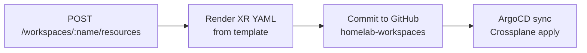
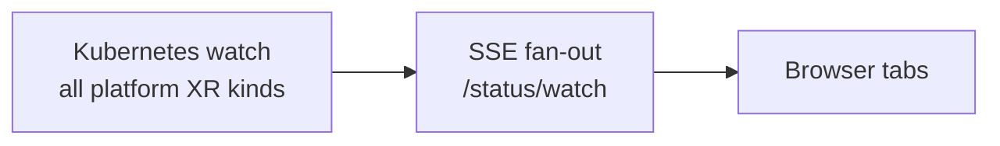

# launchpad-api

Go backend for [Launchpad](https://github.com/cujarrett/launchpad). Two paths, strictly separated:

- **Write** — a form submission commits platform XR YAML to GitHub. ArgoCD syncs it. Crossplane provisions it. This binary never touches the Kubernetes API on the write path.
- **Read** — a Kubernetes dynamic client watches all platform XR kinds and fans status events out over SSE to every connected browser tab.

GitHub is the source of truth. The cluster is the execution engine.

## How it works

**Write path**



**Read path**



Stdlib only — no web framework.

## Guest sandbox

Unauthenticated users get a sandbox — a 10-minute real workload against the real cluster. The API:

1. Picks a slot (`demo1`–`demo5`) from a fixed pool to bound AWS resource creation
2. Picks a random two-word name (`cosmic-anvil`, `golden-llama`)
3. Commits `namespace.yaml` + XR YAML for each selected resource to GitHub
4. Returns `{ name, expiresAt }` — the browser polls status over SSE

A cleanup goroutine runs every minute, reads `guest.yaml` from each workspace directory, and deletes expired workspaces by removing their files from GitHub. ArgoCD propagates the deletion.

Guest resources share one SPIRE trust anchor and the same cluster but get isolated namespaces, scoped IAM roles, and independent service bindings.

## Auth

Contributor endpoints require a valid JWT from Azure Entra ID, validated against the JWKS endpoint. Guest endpoints are unauthenticated but capped: 5 active sandboxes, 10 resources each.

`ENTRA_AUTH_DISABLED=true` bypasses JWT validation for local dev — blocked on port 443 in production.

## Local dev

```bash
# Required
export LAUNCHPAD_API=<github-pat>        # contents:write on cujarrett/homelab-workspaces
export ENTRA_TENANT_ID=<tenant-guid>
export ENTRA_API_CLIENT_ID=<client-id>

# Skip auth locally
export ENTRA_AUTH_DISABLED=true

just run
curl http://localhost:8080/healthz
```

## Commands

| Command | What it does |
|---|---|
| `just ci` | `lint → test → build` |
| `just lint` | `go mod tidy -diff` + `golangci-lint` |
| `just test` | `go test -race ./...` |
| `just build` | `go build -o launchpad-api .` |
| `just run` | `go run .` |

## Environment variables

| Variable | Required | Description |
|---|---|---|
| `LAUNCHPAD_API` | yes | GitHub PAT with `contents: write` on `cujarrett/homelab-workspaces` |
| `ENTRA_TENANT_ID` | yes | Azure Entra ID tenant GUID |
| `ENTRA_API_CLIENT_ID` | yes | Client ID of the API app registration |
| `PORT` | no | HTTP listen port (default `8080`) |
| `ENTRA_AUTH_DISABLED` | no | `true` to skip JWT validation — blocked on port 443 |
| `GUEST_IMAGE` | no | Container image for guest API deployments |
| `GUEST_SPA_IMAGE` | no | Container image for guest SPA deployments |

## Deployment

ARM64 Docker image built by CI, pushed to GHCR, deployed as an `Api` XR via ArgoCD. A `launchpad-secrets` Kubernetes Secret injects `LAUNCHPAD_API`, `ENTRA_TENANT_ID`, and `ENTRA_API_CLIENT_ID` via `envFrom`.

### Rotating `LAUNCHPAD_API`

```bash
print -n "Paste new token: "
read -rs NEW_TOKEN
echo
kubectl patch secret launchpad-secrets -n launchpad \
  --type='json' \
  -p='[{"op":"replace","path":"/data/LAUNCHPAD_API","value":"'"$(echo -n "$NEW_TOKEN" | base64)"'"}]'
unset NEW_TOKEN

kubectl rollout restart deployment/launchpad-api -n launchpad
```

### Rotating `HOMELAB_PAT`

Separate from `LAUNCHPAD_API` above, and easy to confuse — both are fine-grained PATs with `contents: write` on `cujarrett/homelab-workspaces`. `LAUNCHPAD_API` is a Kubernetes Secret the running binary reads to commit user submissions. `HOMELAB_PAT` is a GitHub Actions secret only CI uses, to commit this repo's own image tag. Rotating one leaves the other alone.

When `HOMELAB_PAT` expires, `deploy` fails on `Bad credentials (HTTP 401)` while `test` and `build-and-push` stay green. Images keep building and the cluster keeps running the old tag, so nothing looks broken until someone checks what is actually deployed.

```bash
# 1. Mint a replacement at https://github.com/settings/personal-access-tokens
#    Repository access — cujarrett/homelab-workspaces only
#    Permissions — Contents: Read and write

# 2. Replace the secret
print -n "Paste new token: "
read -rs NEW_TOKEN
echo
gh secret set HOMELAB_PAT --repo cujarrett/launchpad-api --body "$NEW_TOKEN"
unset NEW_TOKEN

# 3. Revoke the old token, then confirm the next merge to main still deploys
gh run watch --repo cujarrett/launchpad-api \
  "$(gh run list --repo cujarrett/launchpad-api --branch main --limit 1 --json databaseId --jq '.[0].databaseId')"
```
